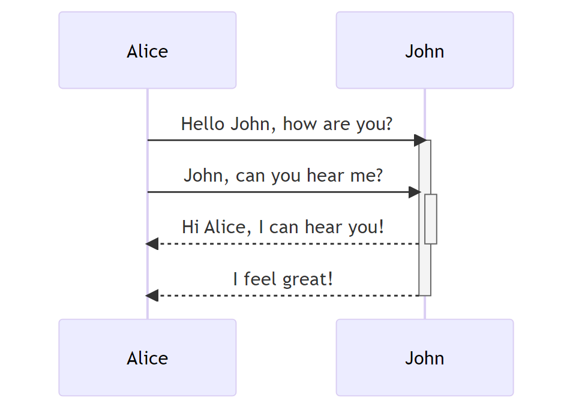

# pandoc-mermaid-chartjs-filter

Pandoc filter for creating diagrams with mermaid, Chart.js or others provided via syntax blocks in markdown docs.

## Installation

```sh
npm install -g pandoc-mermaid-chartjs-filter
```

## Usage

Just run pandoc and declare to use the pandoc-mermaid-chartjs-filter with `---filter chart-filter`.

```sh
pandoc document.md --filter chart-filter -o document.html
```

You can also use the following commands:

```sh
pandoc document.md --filter mermaidjs-filter -o document.html
pandoc document.md --filter chartjs-filter -o document.html
pandoc document.md --filter diagram-filter -o document.html
```

On windows use the following command:

```sh
pandoc document.md --filter chart-filter.cmd -o document.html
pandoc document.md --filter chartjs-filter.cmd -o document.html
pandoc document.md --filter mermaidjs-filter.cmd -o document.html
pandoc document.md --filter diagram-filter.cmd -o document.html
```


To create a mermaid diagram, add a fenced code block to the markdown file, assign `mermaid` as the class, and provide the plain mermaid code.

~~~markdown
```mermaid
sequenceDiagram
    Alice->>+John: Hello John, how are you?
    Alice->>+John: John, can you hear me?
    John-->>-Alice: Hi Alice, I can hear you!
    John-->>-Alice: I feel great!
```
~~~

The code above will create the following chart:



To create a Chart.js diagram, add a fenced code block to the markdown file, assign `chartjs` as the class, and provide the options for the chart formatted as YAML.

~~~markdown
```chartjs
type: bar
data:
  labels:
  - Red
  - Blue
  - Yellow
  - Green
  - Purple
  - Orange
  datasets:
  - label: "# of Votes"
    data:
    - 12
    - 19
    - 3
    - 5
    - 2
    - 12
    borderWidth: 1
options:
  scales:
    y:
      beginAtZero: true
```
~~~

The code above will create the following chart:


### Advanced Usage

The `pandoc-mermaid-chartjs-filter` provides additional options to configure the results. Therefore you have to use the special pandoc syntax for code blocks to set the additional options.

~~~markdown
```{.mermaid [option]=[value] [optionN]=[valueN]}
...
~~~

AS you can see, you have to enclose the code block class in curly braces, add a point before the class identifier and, seperated by a space, set as much options and values, as you like to.

~~~markdown
```{.mermaid format="png" theme="forest" width="1200"}
sequenceDiagram
    Alice->>+John: Hello John, how are you?
    Alice->>+John: John, can you hear me?
    John-->>-Alice: Hi Alice, I can hear you!
    John-->>-Alice: I feel great!
```
~~~

The example above sets the `format` to `png`, the `theme` to `forest` and the `width` to `1200`.

- `background`: Sets the background color of the diagram or chart. The default value is `white`.
- `caption`: Sets the caption for the diagram or chart. This caption will be used for the `alt` and `title` attribute in HTML.
- `filename`: Sets the filename for the rendered output file. The default value is `false`, so the rendered images will be named automatically. The filename format follows `figure-<index>.<format>`. Regard: If the filename is set manually, the format of the rendered image will follow the filename extension.
- `format`: Sets the format of the rendered image. Currently supports `png`, `svg`, and `pdf`. The default value is `png`.
- `inline`: Sets the handling of the rendered image data. This means, that the images won't be written to the file system, just returned as encoded image data to pandoc. Default value is `false`.
- `scale`: Sets the scaling factor of the rendered image. Currently only affects diagrams, that are rendered with Puppeteer, namely Mermaid.
- `skip`: Skips the code block without rendering an image and without replacing the code with an image. This is necessary, if you want to keep Mermaid code blocks as code examples. Default value is `false`.
- `theme`: Sets the theme to be used for rendering mermaid diagrams. Default value is `default`.
- `width`: Sets the width of the rendered image. Default value is `800`.

## LICENSE

MIT License

Copyright (c) 2023 Mark Lubkowitz

Permission is hereby granted, free of charge, to any person obtaining a copy
of this software and associated documentation files (the "Software"), to deal
in the Software without restriction, including without limitation the rights
to use, copy, modify, merge, publish, distribute, sublicense, and/or sell
copies of the Software, and to permit persons to whom the Software is
furnished to do so, subject to the following conditions:

The above copyright notice and this permission notice shall be included in all
copies or substantial portions of the Software.

THE SOFTWARE IS PROVIDED "AS IS", WITHOUT WARRANTY OF ANY KIND, EXPRESS OR
IMPLIED, INCLUDING BUT NOT LIMITED TO THE WARRANTIES OF MERCHANTABILITY,
FITNESS FOR A PARTICULAR PURPOSE AND NONINFRINGEMENT. IN NO EVENT SHALL THE
AUTHORS OR COPYRIGHT HOLDERS BE LIABLE FOR ANY CLAIM, DAMAGES OR OTHER
LIABILITY, WHETHER IN AN ACTION OF CONTRACT, TORT OR OTHERWISE, ARISING FROM,
OUT OF OR IN CONNECTION WITH THE SOFTWARE OR THE USE OR OTHER DEALINGS IN THE
SOFTWARE.
